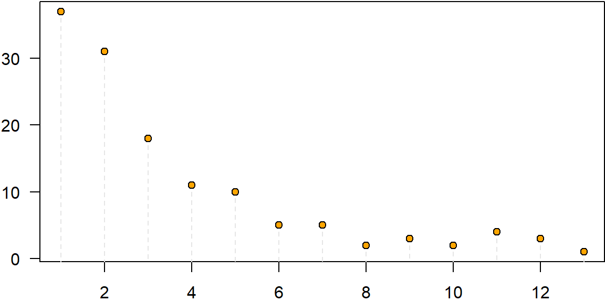
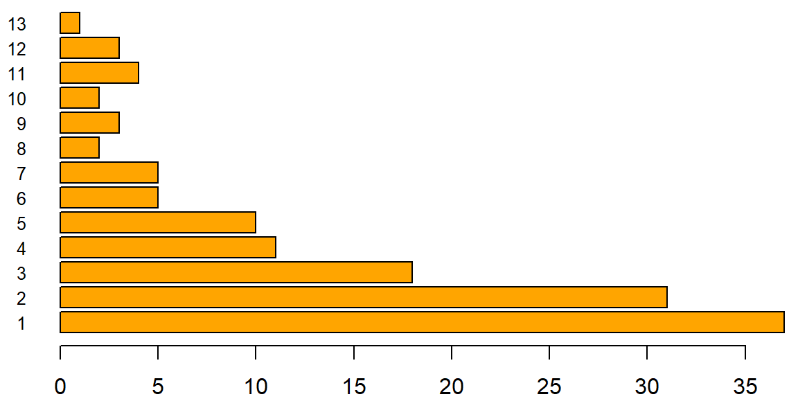
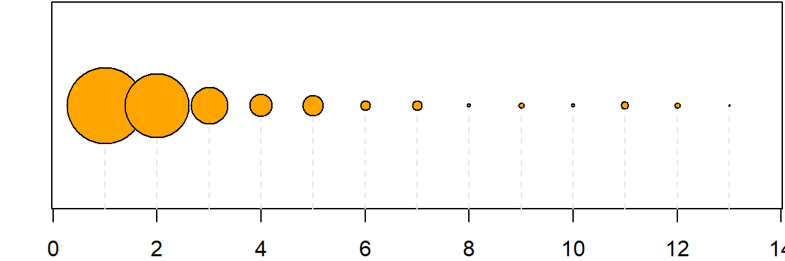

DSV - Lab 1
===========

*27 February 2026*

**Objective:**
Learn basic techniques for descriptive statistics using spreadsheets.

**Tool:**
Microsoft Excel

Exercise 1
----------

**Dataset**

Serie A Top Scorers Ranking, 2025/26 Season, Matchday 25

-   File: `data/Scorers2026.csv`
-   Downloaded from data published by [Corriere della sera](https://www.corriere.it/sport/calcio/serie-a/marcatori/).

**Tasks**

1.  Load the data from the scorers dataset
    -   Use the *Data* menu and choose *Get External Data*
    -   Select the CSV file as a text file

        - Is the data delimited or fixed-width?

        - What is the delimiter?

2.  Calculate summary statistics for the goals distribution:
    -   Central tendency: mean, median, midrange, mode
    -   Dispersion: standard deviation, MAD, IQR, range

        - Which indices are available as built-in functions in Excel?

        - Which ones are most suitable for describing the distribution?

3.  Calculate the frequency distribution table for the number of goals in two ways:
    1.  using the Pivot function
        -   select the data and choose *Insert* then *Pivot Table*
        -   add the number of goals as a row label
        -   add the player in values as *count*
    2.  using the `COUNTIF` formula, which accepts as parameters
        -   the range of cells to count in
        -   the value to count occurrences of

        Example:

        |       | A    | B | C      | D                          |
        |-------|:----:|:-:|:------:|----------------------------|
        | **1** | Data |   | Value  | Frequency                  |
        | **2** | 2    |   | 5      | `=COUNTIF(A1:A4,C1)`       |
        | **3** | 3    |   |        | ↑ number of values = 5     |
        | **4** | 7    |   |        |                            |
        | **5** | 5    |   |        |                            |

    **Tip:** to copy the formula, use [absolute references](#absolute-references-in-excel) (with `$`).
    
4.  Build a frequency distribution table that shows, for each team, the number of players who scored at least one goal for that team.

    -   Use both the *Pivot* approach and the formula approach.

5.  Given the number of goals for each player, compute the frequency distribution table for value intervals (*bins*):
    -   define 10 intervals of equal width
    -   the intervals must cover the entire range and have an integer width
    -   use the ability of `COUNTIF` to accept a criterion, e.g., `"<4"`, which can be built by concatenating a comparison operator with a value. The value can be taken from a cell: for example, the criterion `"<" & C1` allows counting how many values are less than the value in cell *C1*.

    Example:

    |       | A | B | C | D                             |
    |-------|:-:|:-:|:-:|-------------------------------|
    | **1** | 2 |   | 4 | `=COUNTIF(A1:A4,"<"&C1)`      |
    | **2** | 3 |   |   | ↑ number of values < 4        |
    | **3** | 7 |   |   |                               |
    | **4** | 5 |   |   |                               |

    - How are the intervals defined?

    - Are the interval endpoints included or excluded?

6.  Represent the frequency distribution tables graphically. You need to define a numerical variable (the frequency) and a categorical variable (the goal interval). Different visual objects and attributes can be used[^1].

    -   Position of objects (points) (*Scatter* or *Line*)

        

    -   Length of bars (*Bar*)

        

    -   Area (*Bubble*)

        

    To correctly define which values to use and how, it is often necessary to use *Select Data*. The dialog allows you to specify which ranges contain the data for *X* and *Y*.

    - How easy is it to obtain the desired visualization?

    - Do the generated charts comply with integrity principles?

[^1]: 
    The charts are provided as examples only, they do not refer to the exercise data and should not be reproduced as shown.

Exercise 2
----------

**Dataset**

Transparent Assets, declared assets of Italian parliamentarians.

-   File: `data/openpolis-patrimoni-trasparenti.zip`
-   Provided by the [OpenPolis](http://www.openpolis.it) association

**Tasks**

1.  Load the income data for the year 2014 from the dataset.

2.  Calculate summary statistics for the income distribution (column `totale_730_dichiarante`).

    - Which summary indicators are most useful for describing the income distribution?

3.  Produce the frequency distribution table.

    - Which intervals should be used?

    - Is a linear or logarithmic subdivision more useful?

4.  Visualize the income distribution using one of the representations from the previous exercise.

    - Which representation is most appropriate?

---

### Absolute References in Excel

   In Excel, cell references can be *relative* (e.g., `A1`) or *absolute* (e.g., `$A$1`). When you copy a formula:
    - **Relative references** adjust automatically (e.g., `A1` becomes `A2` when copied down)
    - **Absolute references** stay fixed (e.g., `$A$1` remains `$A$1`)
    - **Mixed references** fix only row or column (e.g., `$A1` or `A$1`)
    
    Example: to count occurrences of different values (C1, C2, C3...) in a fixed range A1:A5:
    
    |       | A | B | C      | D                          |
    |-------|:-:|:-:|:------:|----------------------------|
    | **1** | 2 |   | 2      | `=COUNTIF($A$1:$A$5,C1)`   |
    | **2** | 3 |   | 3      | `=COUNTIF($A$1:$A$5,C2)`   |
    | **3** | 3 |   | 5      | `=COUNTIF($A$1:$A$5,C3)`   |
    | **4** | 7 |   | 7      | `=COUNTIF($A$1:$A$5,C4)`   |
    | **5** | 5 |   |        |                            |
    
    When copying D1 down, `$A$1:$A$5` stays fixed while `C1` becomes `C2`, `C3`, etc.
